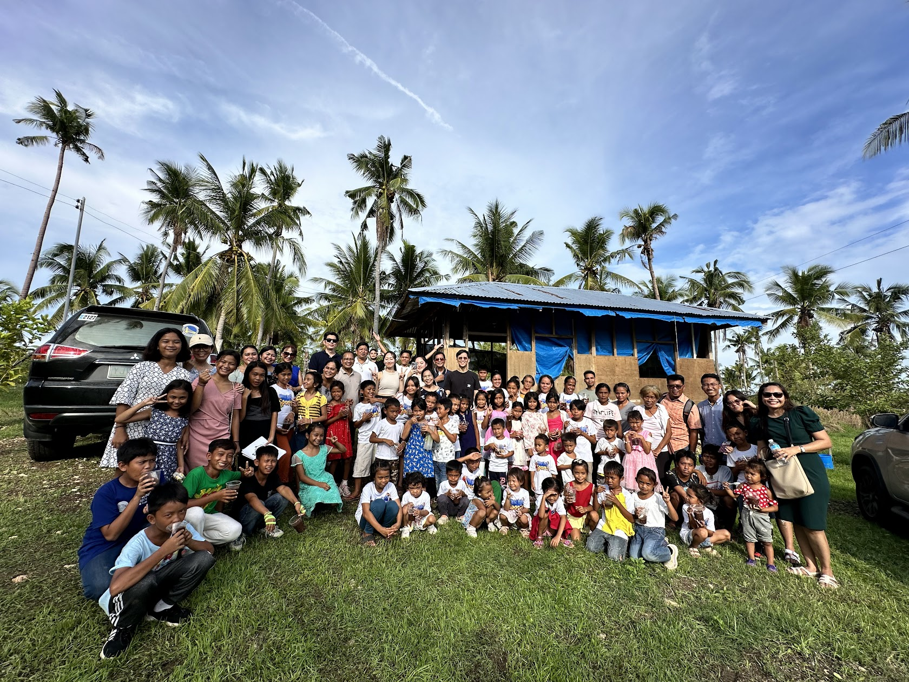

# Seeds of Life Global

**Where purpose takes root and lives bear fruit.**

The website of **Seeds of Life Global Inc.**, a Philippine non-stock, non-profit
organization based in Sibonga, Cebu. It shares the organization's mission,
community work, leadership, partnerships, and opportunities to participate.



## About the organization

Seeds of Life Global nurtures purpose in children through faith, character,
mentorship, and community. Its wider vision connects education, practical skills,
environmental care, and support for families.

The website distinguishes current activities from planned initiatives and
long-term vision. Program availability and dates should be confirmed directly
with the organization.

## Website features

- Photography-led homepage with mission, community stories, and impact context.
- About page introducing the organization, its faith, and its founders.
- Programs page separating current work, planned initiatives, and wider vision.
- Community photo gallery with an accessible enlarged-photo viewer.
- Individual leadership profiles and a dedicated Mt. Moriah story.
- Animated partner-logo loop linking to partner websites.
- Contact and Get Involved pages for inquiries, volunteering, and partnerships.
- Responsive navigation, keyboard focus support, and reduced-motion handling.
- Page metadata, social-sharing images, favicon, sitemap, and robots configuration.

## Technology

| Area | Technology |
| --- | --- |
| Framework | Next.js 16, App Router |
| Interface | React 19 and TypeScript |
| Styling | Tailwind CSS 4 and custom CSS |
| Icons | Lucide React |
| Hosting | Vercel |
| Domain/DNS | GoDaddy |
| Email integration | Resend, when configured |
| Browser testing | Playwright with Chromium |

## Run locally

Use Node.js **20.9 or newer** and npm.

```bash
git clone https://github.com/kthxxx/SeedsofLifeGlobal-Website.git
cd SeedsofLifeGlobal-Website
npm ci
```

Copy `env.example` to `.env.local`. On Windows PowerShell:

```powershell
Copy-Item env.example .env.local
```

Set the canonical website URL. Leave email credentials empty until you intend to
enable delivery; the example credentials are placeholders, not working secrets.

```bash
npm run dev
```

Open [http://localhost:3000](http://localhost:3000).

### Environment settings

| Variable | Purpose |
| --- | --- |
| `NEXT_PUBLIC_SITE_URL` | Canonical website origin used for metadata and contact-origin validation. |
| `RESEND_API_KEY` | Server-side Resend credential, required for email delivery. |
| `CONTACT_FROM_EMAIL` | Sender address on a domain verified with Resend. |
| `CONTACT_TO_EMAIL` | Team inbox receiving website inquiries. |

For deployments that include the security-hardening changes, also configure:

| Variable | Purpose |
| --- | --- |
| `UPSTASH_REDIS_REST_URL` | HTTPS endpoint for shared contact-form rate limiting. |
| `UPSTASH_REDIS_REST_TOKEN` | Standard read/write Redis REST token. |
| `CONTACT_ALLOWED_ORIGINS` | Optional comma-separated additional exact form origins. |

With the hardened endpoint, missing Redis configuration or an outage blocks
production submissions safely rather than bypassing rate limiting. Local
development uses a bounded in-memory limit.

**Never commit `.env.local` or expose email/Redis credentials with a
`NEXT_PUBLIC_` prefix.** See the
[security deployment guide](https://github.com/kthxxx/SeedsofLifeGlobal-Website/blob/codex/security-hardening/docs/security-deployment.md)
for the hardened endpoint's setup and limitations.

## Quality checks

```bash
npm run lint
npx tsc --noEmit --incremental false
npm run build
```

Run the existing page tests with the development server running in another
terminal:

```bash
node --test tests/*.test.mjs
```

The page tests default to `http://127.0.0.1:3000`. Set `HERO_TEST_URL` to test
another local server. Security tests, when included, use mocked network
boundaries and do not send emails or access a real Redis database.

To serve a production build locally:

```bash
npm run build
npm run start
```

## Deploy

1. Import the GitHub repository into Vercel and select the production branch.
2. Configure the required environment variables in Vercel's project settings.
3. Deploy the project using Vercel's Next.js integration.
4. Add the custom domain in Vercel and apply the DNS records Vercel provides in
   GoDaddy. Keep unrelated email and DNS records intact.
5. Check the live HTTPS website on desktop and mobile after deployment.

Changing environment settings requires a redeployment. Email delivery needs
separate Resend setup; deploying the website alone does not configure email.

## Project structure

```text
app/          Pages, layouts, metadata, and the contact API route
components/   Navigation, gallery helpers, logo loop, and reusable UI
lib/          Organization content, partner links, and shared helpers
public/       Photos, leadership portraits, logos, and other static assets
tests/        Automated checks
env.example   Environment configuration template
```

## Content and attribution

Update organization content in `lib/data.ts`, partner links in `lib/partners.ts`,
and gallery entries in `lib/gallery-photos.ts`. Keep source context and clearly
identify planned activities; do not present unconfirmed figures as verified.

The logo-loop component is adapted from [React Bits](https://reactbits.dev).
Partner asset provenance is recorded in [public/Logo/SOURCES.md](public/Logo/SOURCES.md).
Partner names and logos belong to their respective organizations. Inclusion does
not grant permission to reuse their branding.

No repository-wide license is declared. Do not assume the source, organization
photographs, or branding are licensed for redistribution; obtain permission
before reusing them.

## Contact

Seeds of Life Global Inc. · Poblacion, Sibonga, Cebu, Philippines

[seedsoflifeglobal@gmail.com](mailto:seedsoflifeglobal@gmail.com)
